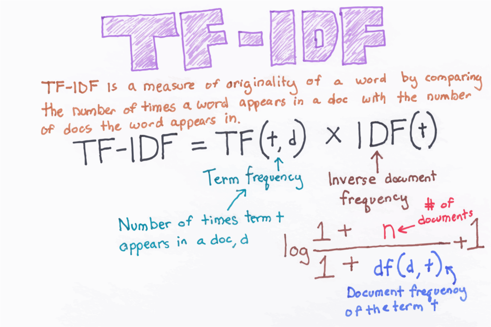
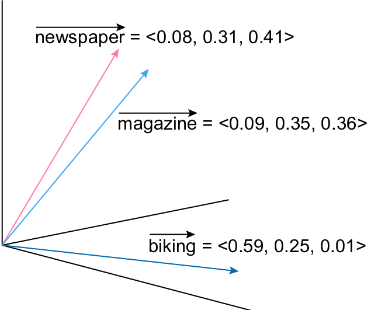
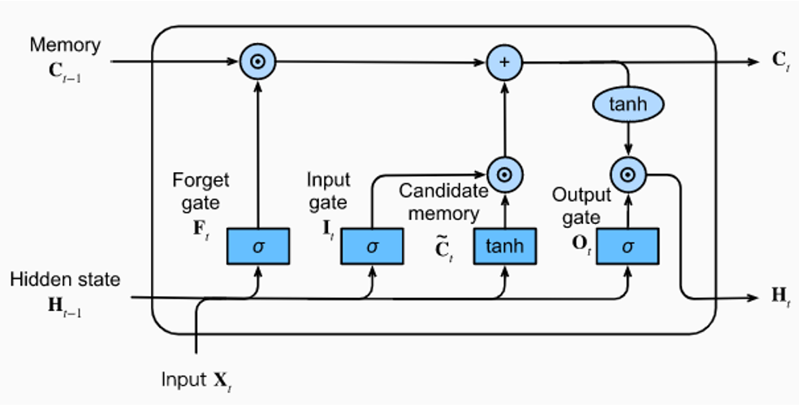
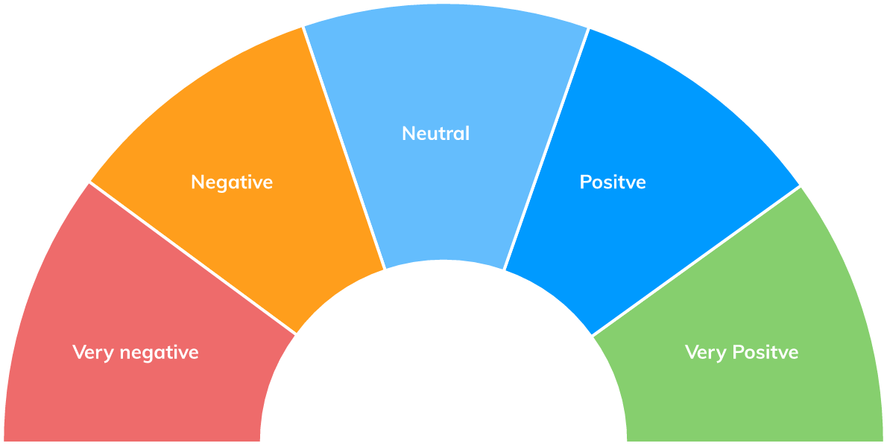

# Procesamiento del Lenguaje Natural - UBA/CEIA
#
#### Alumno: Lucas Rivela
#### Cohorte: 5ta - 2022
#

## Desafio 1: Word2Vec
    
Como su nombre indica, Word2vec representa cada palabra distinta con una lista particular de números llamada vector. Los vectores están escogidos cuidadosamente de forma que una función matemática sencilla (la similitud coseno entre los vectores) indica el nivel de la similitud semántica entre las palabras representada por dichos vectores.

### Colab: [Notebook](Desafio_1/1a%20-%20word2vec.ipynb)
  
## Desafio 2: Simple chatbot
  
Tienen en cuenta las palabras o frases del interlocutor, que les permitirán usar una serie de respuestas preparadas de antemano. Estos son capaces de reconocer la manera en la que una frase está formulada gracias a una serie de patrones comparativos preestablecidos, y de este modo, basándose en las diferentes variables de dicha frase, presentan una respuesta correspondiente. De esta manera, el bot es capaz de seguir una conversación con más o menos lógica, pero sin saber realmente de qué está hablando.

### Colab: [Notebook](Desafio_2/2c%20-%20bot_tfidf_nltk.ipynb)
  
## Desafio 3: Word Embeddings
  
Es el nombre de un conjunto de modelos de lenguaje y técnicas de aprendizaje en procesamiento del lenguaje natural (PLN) en donde las palabras o frases del lenguaje natural son representadas como vectores de números reales.
  

### Colab: [Notebook](Desafio_3/3b%20-%20Custom%20embedding%20con%20Gensim.ipynb)

## Desafio 4: Predict Next Word

Predicción de próxima palabra utilizando redes LSTM entrenadas con un libro.

### Colab: [Notebook](Desafio_4/4d_predicción_palabra.ipynb)

## Desafio 5: Sentiment Analysis with Embeddings + LSTM

Determinar un puntaje en base a un texto escrito por un cliente.

### Colab: [Notebook](Desafio_5/5%20-%20clothing_ecommerce_reviews.ipynb)

## Desafio 6: QA bot

Entrenar un bot conversacional a partir de un dataset de preguntas y respuestas.

### Colab: [Notebook](Desafio_6/6-%20bot_qa.ipynb)